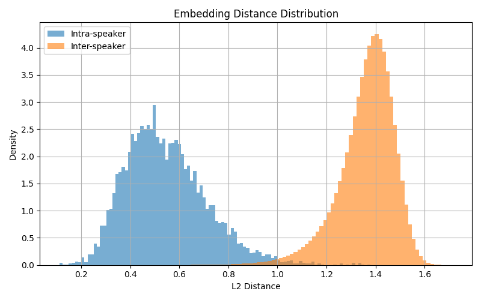

# Voice Finder

This repo provides code to train a Voice Speaker Embedding Model. The model takes as input an audio recording and provides an embedding vector that captures the speaker's identity. A use case for such a model could be a speaker identification system or voice similarity search.

For a full report of the research into creating this model, see the [report](report.md).

## Code

The code is in the form of Jupyter notebooks, located in the `notebooks/` folder. The notebooks `create_dataset.ipynb` and `create_dataset_voxceleb2.ipynb` are used to preprocess and convert the raw datasets into Zarr archives that are compatible with the model training and inference code. The notebook `train_model.ipynb` is used to train the model.

## Installation

The repository uses `uv` as a package manager. Follow the [instructions](https://docs.astral.sh/uv/getting-started/installation/) to install it. Then run the command:

```bash
uv sync 
```

to install the dependencies, including the `voice-finder` package and its development dependencies. Launch a Jupyter instance using:

```bash
uv run jupyter notebook --no-browser
```

## Package and Pretrained Model

This repository includes the `voice-finder` Python package, which is automatically installed when you run `uv sync`. The package contains the `VoiceEmbedder` model and `VoiceEmbedderProcessor` processor, necessary for running inference with the pretrained model.

A pretrained model, trained using this repository, is available on the Hugging Face Hub at [johbac/voice-embedder-base](https://huggingface.co/johbac/voice-embedder-base). This model was fine-tuned on the Common Voice 17 (English) Train split dataset to generate 256-dimensional speaker embeddings. Check out the [model card](https://huggingface.co/johbac/voice-embedder-base) for details on usage and performance.

## Model Performance

The pretrained model (`johbac/voice-embedder-base`, Run 10) excels on the Common Voice 17 (en) dev test set, achieving a **Top-1 Accuracy of 94.13%**, **Top-5 Accuracy of 98.17%**, and an **Equal Error Rate of 1.05%**. It performs best on clean, studio-quality audio, effectively distinguishing speakers with well-separated embeddings. Below is a plot showing the intra/inter speaker embedding distances for the model on this dataset, illustrating the clear separation between same-speaker and different-speaker embeddings.



For full performance metrics across datasets, see the [model card](https://huggingface.co/johbac/voice-embedder-base).

## Running the Example Inference Script

The `voice-finder` package includes an example inference script that demonstrates how to use the pretrained model for speaker clustering on the `MLCommons/peoples_speech` dataset. To run it:

```bash
uv run voice-finder-example
```

### Expected Outputs
Running the script generates the following files in the specified `--output` directory (e.g., `output/`):
- **clusters.json**: A JSON file mapping DBSCAN cluster IDs to audio sample IDs from the `peoples_speech` dataset (e.g., `{"0": ["id1", "id2"], "-1": ["id3"]}`).
- **plot.png**: A heatmap of the distance matrix between embeddings, ordered by DBSCAN clusters.
- **umap_plot.png**: A 2D UMAP visualization of the speaker embeddings, with points colored by cluster (noise points in black).

